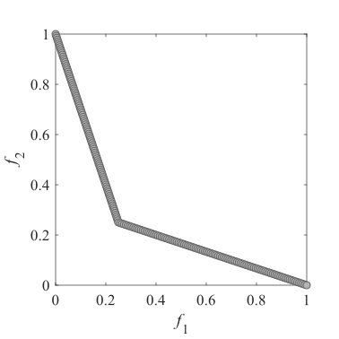
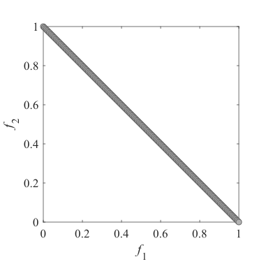
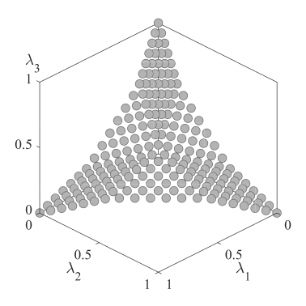
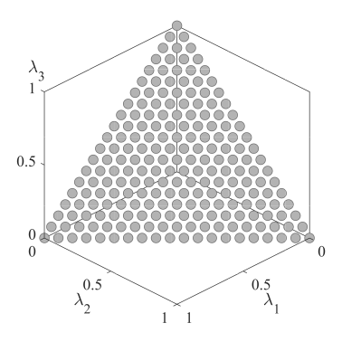
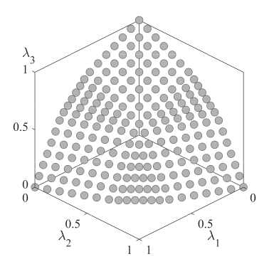

# MOEA-D-DCWV
 MOEA/D with distribution control of weight vector set

## Sample image of weight vector set
||||
|:-:|:-:|:-:|
||||
|Two-objective problems, parameter p=1/4|Two-objective problems, parameter p=2/4|Two-objective  problems, parameter p=3/4|
||||
|Three-objective problems, parameter p=1/6|Three-objective problems, parameter p=2/6|Three-objective  problems, parameter p=3/6|

## How to use
This algorithm works with the [PlatEMO](https://github.com/BIMK/PlatEMO/). Add this algorithm to "PlatEMO/Algorithms/Multi-objective optimization/".

## Reference
Tomoaki Takagi, Keiki Takadama, and Hiroyuki Sato: **A Distribution Control of Weight Vector Set for Multi-objective Evolutionary Algorithms**,  Proc. of the Bio-inspired Information and Communication Technologies ([BICT2019](https://bionetics2019.eai-conferences.org)), Lecture Notes of the Institute for Computer Sciences, Social Informatics and Telecommunications Engineering (LNICST), Vol. 289, Springer, Cham, pp. 70--80, 2019. [DOI](https://doi.org/10.1007/978-3-030-24202-2_6).
