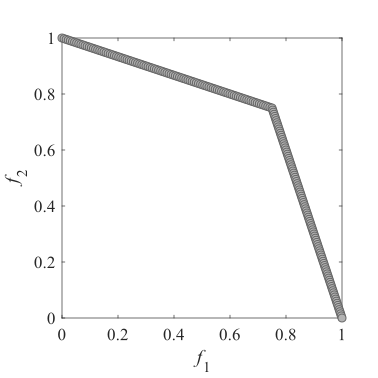

# MOEA-D-DCWVS
Multiobjective evolutionary algorithm based on decomposition with Distribution Control of Weight Vector Set

## Sample image of weight vector set
|Two-objective problems, parameter p=1/4|Two-objective parameter p=2/4|Two-objective parameter p=3/4
|:-:|:-:|:-:|
|Three-objective problems, parameter p=1/6|Three-objective problems, parameter p=2/6|Three-objective problems, parameter p=3/6|

## Reference 
Tomoaki Takagi, Keiki Takadama, and Hiroyuki Sato: **A Distribution Control of Weight Vector Set for Multi-objective Evolutionary Algorithms** Proc. of the Bio-inspired Information and Communication Technologies (BICT 2019), Lecture Notes of the Institute for Computer Sciences, Social Informatics and Telecommunications Engineering (LNICST), Vol. 289, Springer, Cham, pp. 70--80, 2019. [Web](https://link.springer.com/chapter/10.1007%2F978-3-030-24202-2_6), [PDF](https://link.springer.com/content/pdf/10.1007%2F978-3-030-24202-2_6.pdf)

## Note 
This MATLAB algorithm is based on the reference.  
The reference uses the results of the C++ algorithm.  
There are some differences between the reference results and the results of this MATLAB algorithm.
